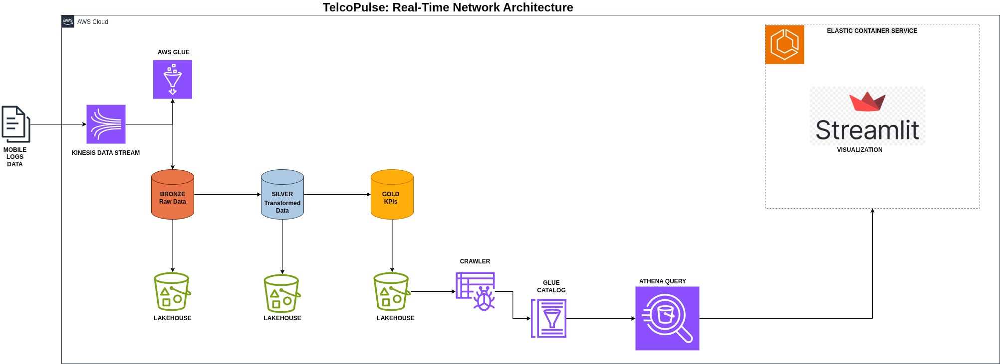
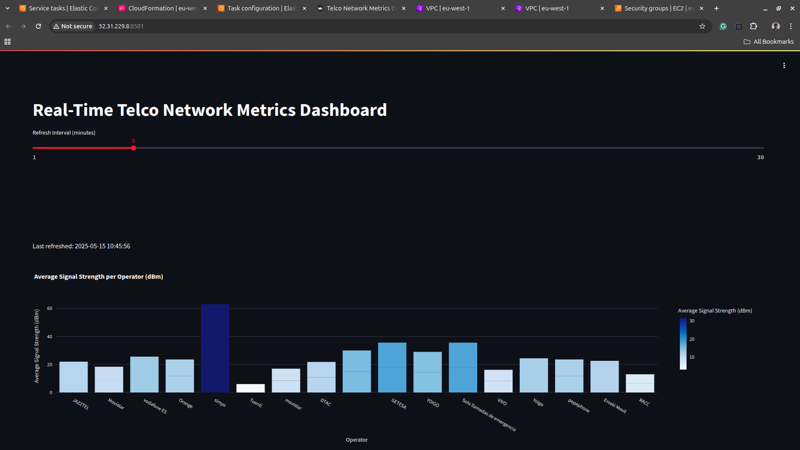
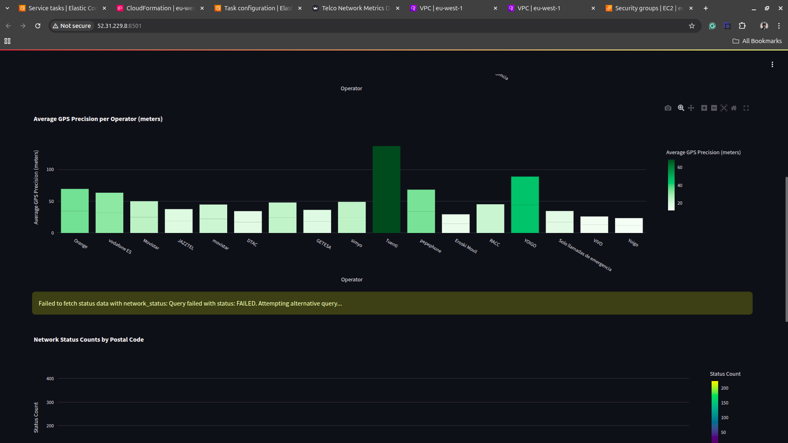
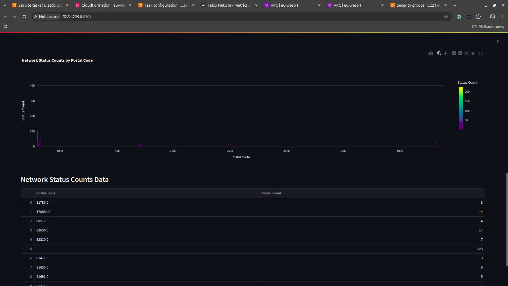

# TelcoPulse: Real-Time Network Metrics Dashboard

##  Objective
Design and implement a real-time data pipeline using AWS-native services to monitor and analyze mobile network performance metrics. The results are visualized via a dynamic Streamlit dashboard that refreshes at regular intervals.

---

##  Project Context
TelcoPulse is a fictional telecom analytics company that aggregates real-time mobile network data (signal strength, network status, and GPS precision) from various providers across the country. This project simulates a real-world scenario where the data engineering team is responsible for building a robust real-time analytics system.

---

## Architecture Overview

> **Note**: Replace the image path above with the correct relative or hosted URL to your architecture diagram.

###  Key Components:
| Component                | Purpose                                                                 |
|--------------------------|-------------------------------------------------------------------------|
| **Amazon Kinesis**       | Ingests real-time mobile network logs                                   |
| **AWS Glue (Spark)**     | Transforms and cleans streaming data in near real-time                  |
| **Amazon S3**            | Stores raw (Bronze), transformed (Silver), and aggregated (Gold) data   |
| **AWS Glue Crawlers**    | Scans and registers metadata in AWS Glue Catalog                        |
| **AWS Athena**           | Performs SQL queries over the Gold data stored in S3                    |
| **Amazon ECS + Streamlit** | Hosts a live dashboard to visualize key metrics                        |

---

##  KPI Metrics Displayed

The following KPIs are calculated and visualized in near real-time:
-  **Average Signal Strength per Operator**
    
-  **Average GPS Precision per Operator**
    
-  **Count of Network Statuses per Postal Code**
    

The Streamlit dashboard auto-refreshes at a configurable interval (e.g., every 5 minutes) to display the most up-to-date insights.

---

##  Pipeline Flow

1. **Data Ingestion**:  
   Mobile logs are sent into an **Amazon Kinesis Data Stream**.

2. **Data Transformation (Bronze → Silver → Gold)**:  
   A **Spark Streaming job on AWS Glue** reads from Kinesis and writes:
   - Raw data → **Bronze Layer**
   - Cleaned/transformed data → **Silver Layer**
   - Aggregated KPIs → **Gold Layer**

3. **Data Lake Storage**:  
   All data layers are stored in **Amazon S3** (Lakehouse structure).

4. **Cataloging**:  
   **AWS Glue Crawlers** crawl the Gold data and update the **Glue Data Catalog**.

5. **Querying**:  
   **AWS Athena** queries the Gold data using SQL.

6. **Visualization**:  
   A **Streamlit app** hosted on **Amazon ECS** queries Athena and displays the dashboard.

---
